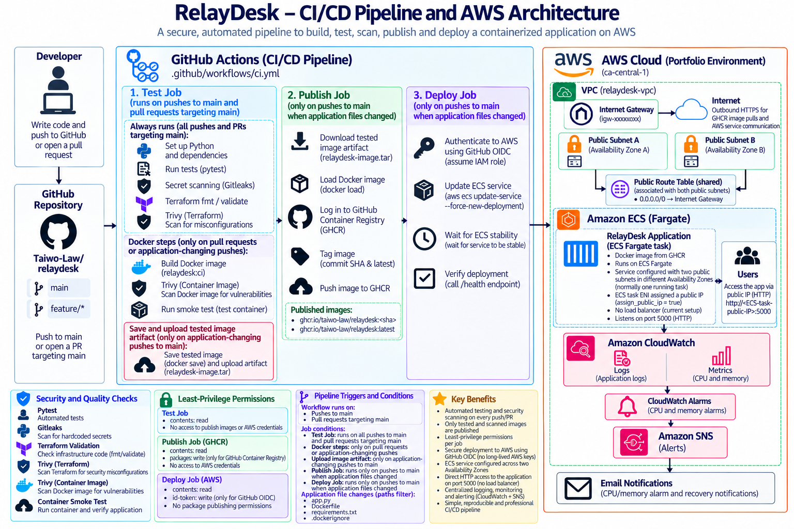

# RelayDesk


RelayDesk is a production style Flask service built as an end to end DevOps portfolio project.


The project demonstrates how an application evolves from a simple locally running service into a containerized, automated, cloud-deployed, observable, and reliable production-style workload.


## Current Features


- Flask REST service
- Root application endpoint
- Health-check endpoint
- Isolated Python virtual environment
- Reproducible Python dependencies
- Git version control
- GitHub source repository
- Dockerized application
- Gunicorn production WSGI server
- Automated testing with pytest
- GitHub Actions continuous integration
- Automated Docker image builds in CI
- Container health smoke testing
- Automated container publishing to GitHub Container Registry
- Commit-SHA and `latest` Docker image tagging
- Published container pull-and-run verification 
- Infrastructure provisioning with Terraform
- AWS VPC networking across multiple public subnets
- Amazon ECS deployment using AWS Fargate
- GitHub Actions authentication to AWS using OIDC
- Automated ECS deployment from GitHub Actions
- Application change detection to prevent unnecessary deployments
- Amazon CloudWatch centralized container logging
- ECS CPU and memory monitoring
- CloudWatch CPU and memory alarms
- Amazon SNS email alerting for alarm and recovery events
- ECS container health checks
- Automatic unhealthy task replacement
- Post-deployment health verification
- ECS deployment circuit breaker with automatic rollback
- Cost-conscious ECS scale-to-zero workflow
- Container image vulnerability scanning with Trivy


## API Endpoints


| Endpoint | Purpose |

|----------|---------|

| `/` | Returns RelayDesk service status |

| `/health` | Application health check |


Example health response:


```json

{

  "status": "healthy"

}

```


## Technology Stack

- Python
- Flask
- Git
- GitHub
- Docker
- Gunicorn
- pytest
- GitHub Actions
- GitHub Container Registry (GHCR)
- Terraform
- AWS
- Amazon VPC
- Amazon ECS
- AWS Fargate
- AWS IAM
- GitHub OIDC
- Amazon CloudWatch
- Amazon SNS

## AWS Architecture


RelayDesk is deployed to AWS using Terraform-managed infrastructure.

The current architecture includes:

- A dedicated Amazon VPC
- Two public subnets across multiple Availability Zones
- An Internet Gateway and public routing
- An Amazon ECS cluster
- AWS Fargate for container compute
- A dedicated ECS task security group
- A Terraform-managed ECS task definition
- A Terraform-managed ECS service
- GitHub Actions authentication to AWS through OpenID Connect (OIDC)

The ECS service uses a configurable desired task count. During development and practice sessions, the service can be scaled to zero when not in use to minimize AWS costs.

## Monitoring, Observability and Reliability

RelayDesk includes AWS-native monitoring and reliability controls.

Application and Gunicorn logs are sent from ECS to Amazon CloudWatch Logs with a seven-day retention period.

Amazon CloudWatch monitors ECS CPU and memory utilization. The current alarms are configured for:

- CPU utilization above 70% for five consecutive minutes
- Memory utilization above 80% for five consecutive minutes

Alarm and recovery events are published to Amazon SNS and delivered through a confirmed email subscription.

RelayDesk also includes:

- ECS container health checks against `/health`
- Automatic replacement of unhealthy ECS tasks
- Post-deployment health verification from GitHub Actions
- Deployment health-check timeouts
- ECS deployment circuit breaker protection
- Automatic rollback to the previous healthy deployment when a new deployment fails

## CI/CD Pipeline

RelayDesk uses GitHub Actions for continuous integration and deployment.

The application deployment flow is:

```text
Git push
    ↓
Automated pytest tests
    ↓
Terraform formatting and validation
    ↓
Application change detection
    ↓
Docker image build
    ↓
Container smoke test
    ↓
Publish image to GHCR
    ↓
GitHub OIDC authentication to AWS
    ↓
Deploy to Amazon ECS
    ↓
Wait for ECS service stability
    ↓
Verify the live /health endpoint

```

## Security and CI/CD Safeguards

RelayDesk incorporates automated security checks, least-privilege access controls, and deployment safeguards.

### Automated Security Scanning

- **Gitleaks:** Scans Git changes for accidentally committed credentials, API keys, and other secrets. A separate full-history scan also verified the existing repository history.
- **Trivy (Terraform):** Detects HIGH and CRITICAL infrastructure security misconfigurations.
- **Trivy (Container):** Scans Docker images for HIGH and CRITICAL OS and Python dependency vulnerabilities with available fixes.
- **CI Enforcement:** Security findings covered by the configured policies cause GitHub Actions to fail before image publishing or deployment.
- **Container Hardening:** Removes pip from the final runtime image after dependency installation to reduce unnecessary software and attack surface.

### Least-Privilege CI/CD Permissions

GitHub Actions separates responsibilities into three jobs:

| Job | GitHub Permissions | Responsibility |
|-----|--------------------|----------------|
| Test | `contents: read` | Testing, validation, security scanning |
| Publish | `contents: read`, `packages: write` | Publish tested Docker images to GHCR |
| Deploy | `contents: read`, `id-token: write` | Authenticate to AWS and deploy to ECS |

The exact Docker image that passes security scanning and smoke testing is transferred to the publishing job through a short-lived GitHub Actions artifact.

AWS authentication uses GitHub OIDC and an IAM role instead of long-lived AWS access keys.

### Deployment Reliability

- ECS performs container health checks against `/health`.
- GitHub Actions waits for ECS service stability and verifies the deployed application's health.
- ECS deployment circuit breaker enables automatic rollback of failed deployments.
- CloudWatch alarms notify through SNS when CPU or memory thresholds are breached and when alarms recover.

### Documented Security Trade-offs

RelayDesk is a portfolio environment rather than a fully hardened production deployment.

- ECS tasks currently use public IPv4 addresses and expose HTTP on port 5000 without a load balancer or HTTPS termination.
- Outbound ECS traffic is limited to TCP port 443 but permits internet destinations for GHCR image pulls and AWS service communication.
- SNS server-side encryption is not enabled to avoid the recurring cost of a customer-managed KMS key.
- Accepted Terraform security exceptions are documented alongside the affected resources.

These limitations are intentionally documented and can be addressed in future architecture improvements.


## Operations Runbook

RelayDesk includes an operations runbook documenting procedures for managing, monitoring, troubleshooting, and safely shutting down the AWS environment.

The runbook covers:

- Starting the ECS Fargate service
- Verifying deployment and application health
- Investigating CloudWatch logs and metrics
- Responding to CloudWatch alarms and SNS notifications
- Troubleshooting failed ECS deployments
- Stopping ECS resources to minimize AWS costs

**[View the RelayDesk Operations Runbook](docs/OPERATIONS.md)**


## Planned DevOps Tooling

- Kubernetes
- Infrastructure automation and configuration management
- Advanced monitoring and dashboards
- Secrets management
- Infrastructure security scanning
- CI/CD security and policy checks
- Additional production deployment strategies


## Running Locally


Install the application dependencies:


```bash

pip install -r requirements.txt

```


Run the application:


```bash

python app.py

```


The service will be available at:


```text

http://127.0.0.1:5000

```


Health check:


```text

http://127.0.0.1:5000/health

```


## Project Goal


The goal of RelayDesk is to demonstrate practical DevOps and SRE skills through the complete application lifecycle, including development, containerization, CI/CD, infrastructure provisioning, cloud deployment, monitoring, security, and reliability improvements.


## Project Status


Work in progress. Additional DevOps capabilities will be introduced incrementally as the project evolves.


